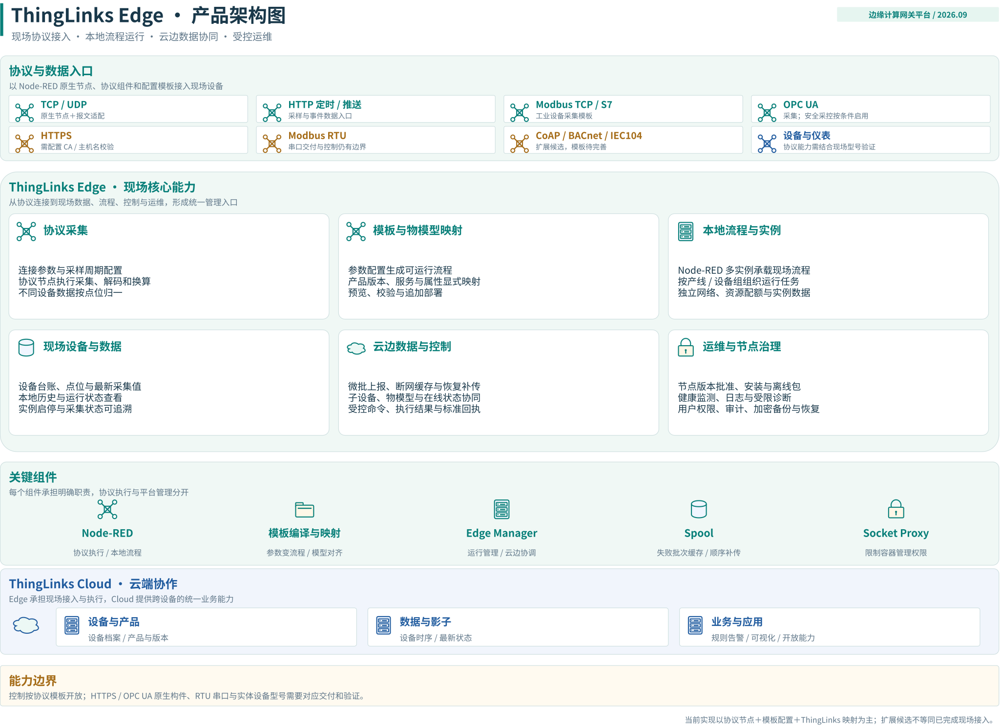
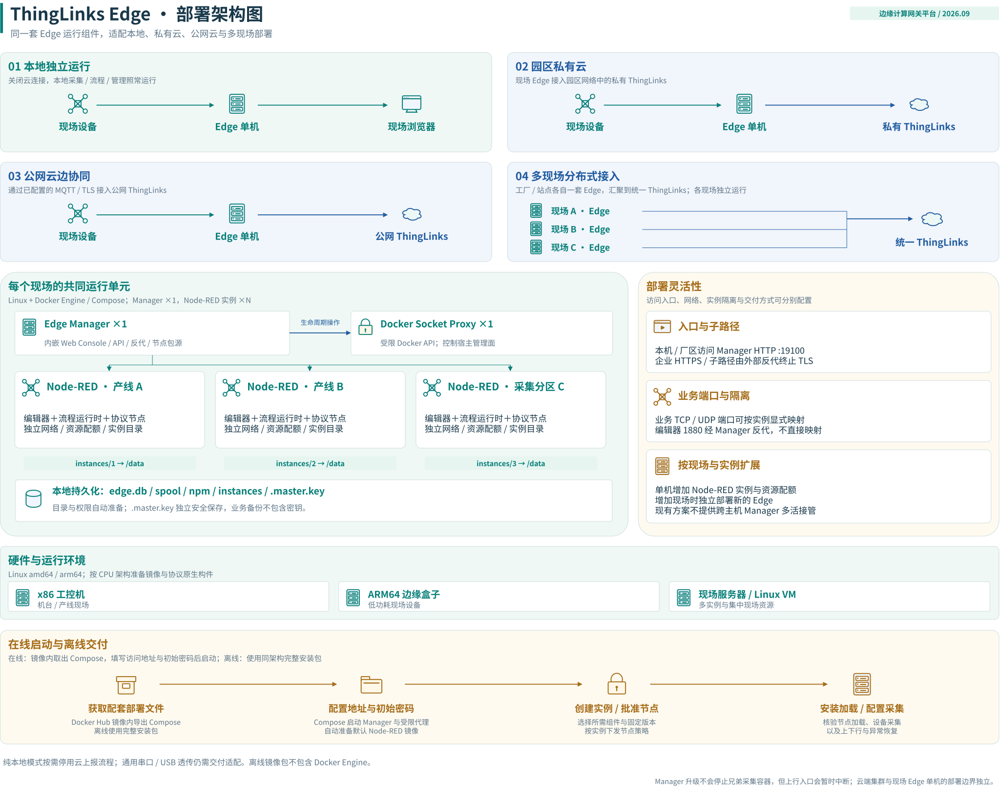
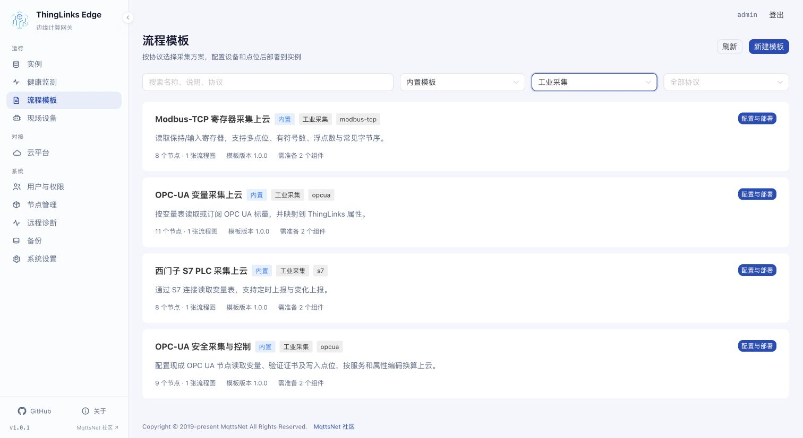
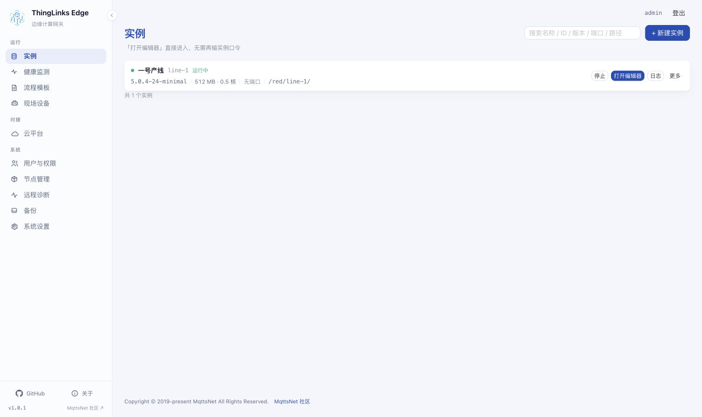
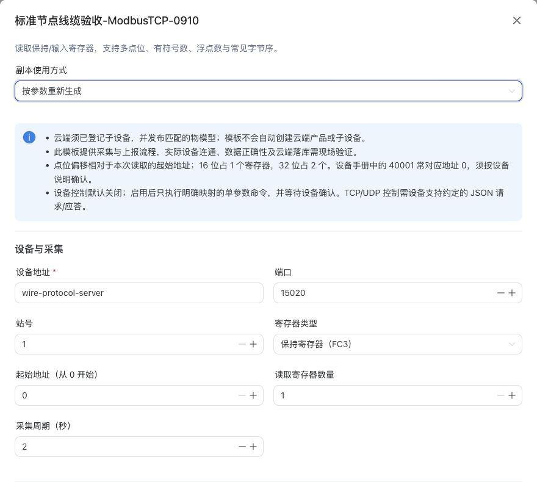
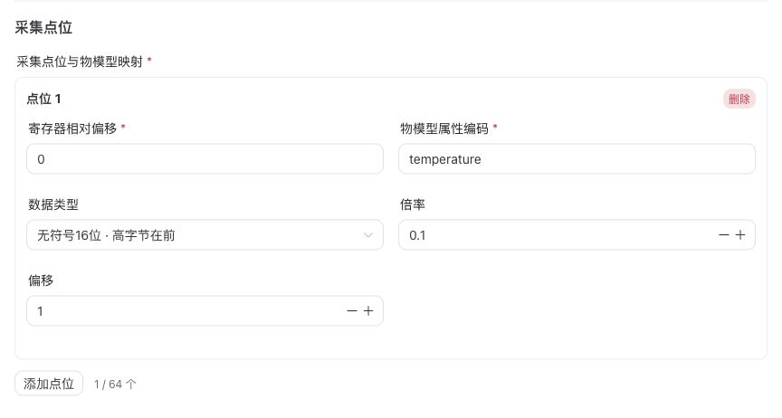
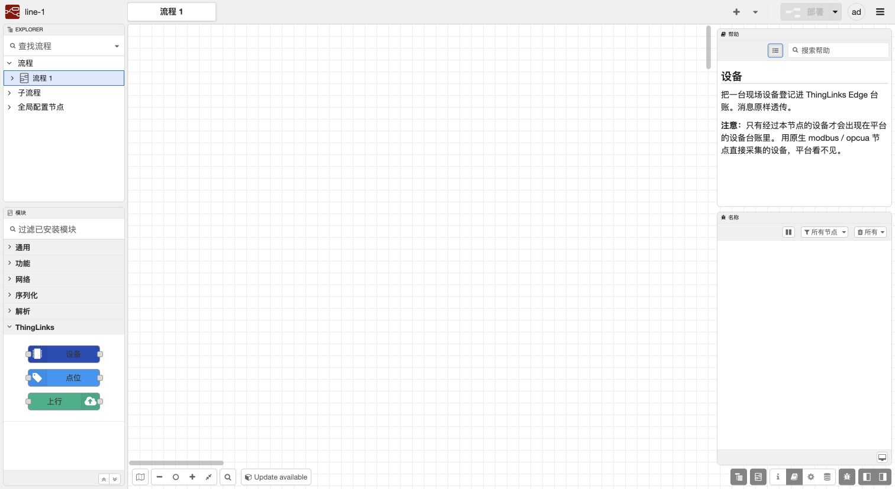
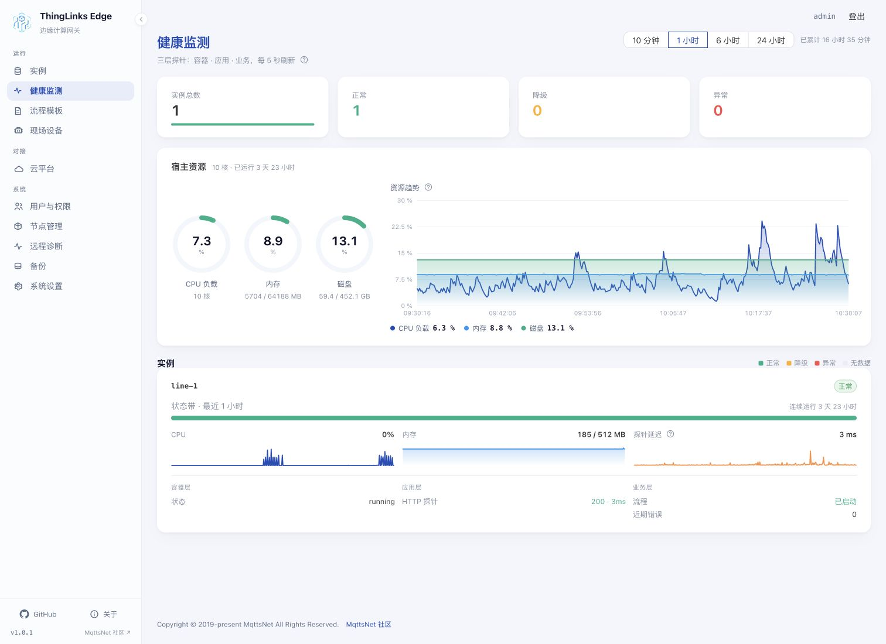
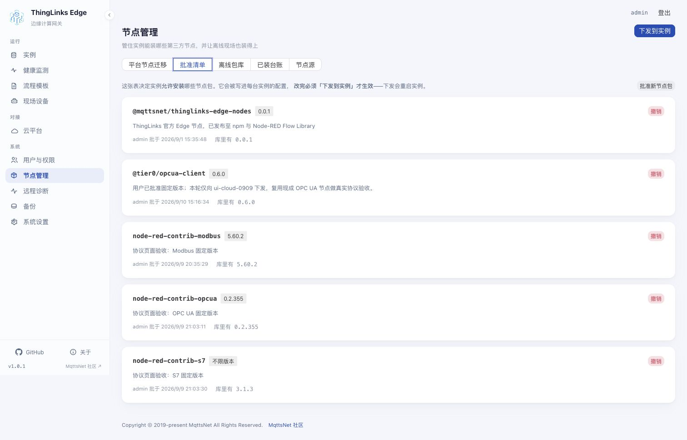

<div align="center">

<a href="https://mqttsnet.com"></a>

# ThingLinks Edge

**边缘计算网关 —— 现场一台机器，一条 `docker compose up`**

[English](README.md) | [简体中文](README.zh-CN.md) | [日本語](README.ja.md) | [한국어](README.ko.md)

[](https://nodejs.org/)
[](https://www.typescriptlang.org/)
[](https://fastify.dev/)
[](https://vuejs.org/)
[](https://hub.docker.com/r/mqttsnet/thinglinks-edge)
[](https://hub.docker.com/r/mqttsnet/thinglinks-edge)
[](LICENSE)

<br>

[](https://mqttsnet.com)
[](https://github.com/mqttsnet/thinglinks-edge)

</div>

---

[快速部署](#快速开始) · [功能预览](#功能预览) · [使用流程](#从接入到运行) · [常见问题](#常见问题)

## 项目简介

ThingLinks Edge 是装在客户现场单机上的**边缘计算网关平台**。它要做的是**云边协同**：
把现场设备接进 ThingLinks 云，把云的能力送到现场 —— 使得在与云的链路断开时，
采集、缓存与本地逻辑仍然照常工作。

ThingLinks 云端平台主仓库：[mqttsnet/thinglinks](https://github.com/mqttsnet/thinglinks)。

Node-RED 多实例托管是**其中一个能力**，不是产品全部，只是当前优先做透的这条切片。

[](docs/images/architecture/edge-product.svg)

点击架构图可查看原尺寸。图中的“扩展候选”“待完善”和条件限制属于能力边界，不能视为全部已交付。

## 核心能力

| 能力 | 说明 |
| --- | --- |
| **实例托管** | Node-RED 实例独立运行；更新 Manager 不自动重启实例 |
| **内置反代** | 统一管理入口与编辑器鉴权；现场协议端口按实例配置 |
| **免密跳转** | 从控制台直接打开任意实例编辑器，无需再输实例口令 |
| **三层健康探针** | 容器 / 应用 / 业务三层，综合判定能识别「进程还在但已经不干活」 |
| **网络隔离** | 一实例一网络 —— 实例之间互不可达 |
| **受限 Docker 端点** | Manager 不接触宿主 socket；每次调用都要过按方法逐条的正则白名单 |
| **运行期挂载前缀** | 同一个镜像既可挂根路径，也可挂企业反代的任意子路径，无需重新构建 |
| **现场设备与点位** | 从 ThingLinks 节点回报建立台账，查看当前值、质量码与更新时间 |
| **协议采集模板** | 按协议筛选、配置参数与点位映射，检查依赖后套用到实例 |
| **节点治理** | 批准清单、离线包库、已装台账与平台节点迁移入口 |
| **云边协同** | 配置网关与云端连接，管理上行聚合、缓存、补传及命令回执 |
| **权限与运维** | 用户角色、实例授权、备份恢复与诊断信息导出 |

## 快速开始

### 环境要求

| 组件 | 版本 |
| --- | --- |
| Docker Engine | 24+，含 Compose v2 |
| 宿主架构 | `x86_64` 或 `aarch64` —— **不支持** 32 位 ARM |
| Node.js | 24 LTS（仅开发需要） |
| pnpm | 10.32+（仅开发需要） |

> **32 位 ARM 未发布。** 决定性原因在下游：Node-RED 官方镜像 5.x 全系只有
> `amd64` / `arm64`，所以 `armv7` 上的 Manager 即使能跑，实例也会被永久锁在
> Node-RED 4.1.x。构建侧还要额外付出代价（`better-sqlite3` 无 32 位 ARM 预编译产物）。
> 更重要的是**并不适配**：真正只能跑 32 位的那批芯片（i.MX6、AM335x、A20）
> 典型只有 256MB–1GB 内存，而 Manager 实测常驻 53 MiB、每个实例约 104 MiB。
>
> **树莓派用户基本不受影响**：Pi 3 / 3B+ / Zero 2 W 的芯片本身都是 64 位的，
> 只有装 32 位系统才会落进 `armv7`。`uname -m` 显示 `aarch64` 可用，`armv7l` 则不行。

### 部署

Manager 镜像已发布在 Docker Hub：[`mqttsnet/thinglinks-edge`](https://hub.docker.com/r/mqttsnet/thinglinks-edge)，
是覆盖 `linux/amd64` 与 `linux/arm64` 的多架构清单 —— x86 工控机和 ARM 边缘盒子敲同一条命令，
docker 自己挑对应那一份。现场机器**不编译任何东西**，装了 docker 就够。

1. 下载本版本的 [docker-compose.yml](docker-compose.yml)，放进一个独立目录。
2. 填写文件顶部两项：实际访问地址（例如 `http://192.168.10.20:19100`）和自选初始管理员密码（至少 12 位）。密码填写在 `x-initial-password` 的引号中；包含 `$` 时写成 `$$`。
3. 在该目录运行：

```bash
docker compose up -d
```

打开配置的地址，用 **admin** 和刚才填写的密码登录，再创建 Node-RED 实例即可。新部署未填密码或密码过短时不会开放控制台；已有管理员的升级不要求重新填写，也不会重置账号。
**无需克隆源码、安装 Node.js、创建 `.env`、手动生成密钥、查询 Docker 组 ID 或提前拉取默认 Node-RED 镜像。**
Compose 自动拉取 Manager、受限 Docker 代理、初始化镜像和默认 Node-RED 5.0.7 镜像，并准备数据目录。

默认数据根为 `/data01/mqttsnet/thinglinks-edge`，必须专用于 Edge。首次启动会生成
`<数据根>/.master.key`（权限 0600），后续重启或升级始终复用。**密钥文件要单独安全保管，业务备份不包含它。**
已有数据却丢失密钥时系统拒绝启动，不会生成新密钥掩盖问题。

服务器默认发布 19100 端口，配置文件中含初始密码，请妥善保管。已有反向代理、rootless Docker、
自定义数据目录或离线要求时，使用 [.env.example](.env.example) 中的高级配置；
**已有 `.env` 和 `MASTER_KEY` 保持原样，新版本会沿用原加密身份。**
其它 Node-RED 版本需准备对应镜像后再选择，默认 5.0.7 由 Compose 自动准备。

`EXTERNAL_URL` 仍是对外链接和 Cookie 策略的唯一来源，不从请求头猜测。
升级时明确修改 `MANAGER_IMAGE` 的版本，再执行 `docker compose pull && docker compose up -d`。
Node-RED 实例独立运行，更新 Manager 不会自动重启采集实例。

<details>
<summary>部署架构：本地、私有云、公网与多现场</summary>

[](docs/images/architecture/edge-deployment.svg)

各现场独立部署 Edge，Node-RED 实例独立运行；多现场汇聚不表示 Manager 跨主机多活。新版交付自动准备默认镜像，独立密钥需要安全保管。

[部署说明与交付边界](docs/architecture/deployment.md)

</details>

## 功能预览

以下为本地演示环境的真实截图，展示实例管理、协议配置和运维入口。画面保留拍摄时的真实状态，不代表现场设备或云端链路已经完成验收。

### 协议采集模板

按协议和分类筛选方案，查看组件依赖，再进入设备、点位与部署配置。图中展示工业采集分类。



<details>
<summary>实例管理：统一查看状态与资源，直接进入编辑器</summary>

实例列表展示运行状态、Node-RED 版本、内存和 CPU 配额，并提供编辑器、日志和生命周期操作入口。



</details>

<details>
<summary>Modbus-TCP 配置：设备连接、寄存器与采集点位</summary>

下面是已保存的 Modbus-TCP 演示配置。设备参数包括地址、端口、站号、寄存器类型、读取范围和采集周期。



点位表将寄存器相对偏移映射到物模型属性，并配置数据类型、字节序、倍率和偏移。
图中 `temperature`、倍率 `0.1` 和偏移 `1` 均来自已有演示配置；拍摄时未修改或部署该配置。



</details>

<details>
<summary>一号产线内部：Node-RED 编辑器与 ThingLinks 节点</summary>

从“一号产线（line-1）”进入实例编辑器，可以查看流程画布、左侧 ThingLinks 设备/点位/上行节点，以及右侧节点帮助。
拍摄时画布为空，下面展示的是编排入口和节点面板，不代表已经部署的采集流程。



</details>

<details>
<summary>健康监测：资源趋势与容器、应用、业务三层状态</summary>

页面显示实例总数、正常/异常数量以及宿主资源趋势，图中一号产线处于正常运行状态。



</details>

<details>
<summary>节点管理：批准清单、离线包库与已装台账</summary>

节点包入库和批准分开管理。准备所需组件后，再按维护窗口将策略下发到目标实例。



</details>

## 适用场景

- **工厂与产线网关**：把不同设备的采集流程放进独立实例，分别设置资源、节点与维护窗口。
- **楼宇与园区现场接入**：将 TCP、UDP、HTTP 或工业协议数据整理成统一点位，再对接 ThingLinks 云平台。
- **多项目共用边缘主机**：通过实例隔离、用户角色和实例授权，管理同一台服务器上的多个采集任务。
- **受限网络与离线现场**：通过预置节点包、批准清单和离线安装包准备运行环境，按配置缓存及补传上行数据。

Edge 负责现场接入、流程运行和本地运维；ThingLinks Cloud 负责云端业务。具体设备、协议节点和上下行能力需按目标环境验证。

## 从接入到运行

| 步骤 | 在哪里操作 | 完成后检查什么 |
| --- | --- | --- |
| 1. 部署与登录 | Docker Compose、控制台 | Manager 健康，管理员可登录 |
| 2. 创建实例 | 实例 | 所选 Node-RED 镜像可用，编辑器能打开 |
| 3. 准备组件 | 节点管理 | 所需包及依赖已入库、已批准，目标实例已成功加载 |
| 4. 配置采集 | 流程模板或 Node-RED 编辑器 | 设备地址、点位、类型、倍率及字节序符合实际设备 |
| 5. 查看现场数据 | 现场设备、健康监测 | 点位当前值、质量码和更新时间符合预期 |
| 6. 接入云端 | 云平台 | 使用实际云端配置，核对上报、命令回执及断线恢复 |
| 7. 日常运维 | 健康监测、日志、备份、远程诊断 | 观察异常，保留备份和独立密钥，安排维护窗口 |

**包存在、包已批准、节点成功加载，是三个不同状态。** 修改批准清单后，需要下发到目标实例才能生效，
这会重启该实例。采集正常也不自动代表下行控制、异常恢复和云端展示已经验证。

## 详细架构与功能

- [技术架构与数据、命令链路](docs/architecture/README.md)
- [功能架构与能力边界](docs/architecture/features.md)
- [部署架构与在线、离线交付](docs/architecture/deployment.md)
- [可编辑架构图源文件](docs/images/sources/thinglinks-edge.drawio)

## 技术栈


## 本地开发

```bash
pnpm install

# 终端 1 —— 后端
cd apps/manager && pnpm build && \
  EXTERNAL_URL=http://localhost:5173 DATA_DIR=/tmp/tle-dev \
  MASTER_KEY=dev-key INITIAL_PASSWORD=initial-password-123 node dist/index.js

# 终端 2 —— 控制台
cd apps/web-console && pnpm dev      # http://localhost:5173
```

要用**自己编的镜像**而不是发布镜像跑整套栈，叠加构建覆盖文件：

```bash
docker compose -f docker-compose.yml -f docker-compose.build.yml up -d --build
```

`docker-compose.yml` 本身是刻意做成「纯拉取」的 —— 那是现场机器用的形态。

## 目录结构

```
thinglinks-edge/
├── apps/
│   ├── manager/                  控制面服务
│   │   ├── src/
│   │   │   ├── core/             领域层：配置、加密、存储、鉴权、实例、
│   │   │   │                     端口、健康、容器规格、docker 客户端
│   │   │   ├── http/             HTTP 层：装配、会话、实例、免密跳转、
│   │   │   │                     反代、控制台托管
│   │   │   └── index.ts          入口
│   │   ├── scripts/              真容器验证套件
│   │   └── Dockerfile
│   └── web-console/              控制台前端（Vue 3 + TypeScript + Naive UI）
├── changelogs/                   每个版本一个文件
├── docker-compose.yml            单机部署
└── .env.example
```

## 验证

任何改动都必须让全量回归保持全绿。`pnpm verify` 会跑单元测试、类型检查、构建，
以及对真实 Docker 守护进程的 **11 次真容器验证** —— 不用模拟上游。

```bash
cd apps/manager && pnpm verify
```

| 套件 | 覆盖 |
| --- | --- |
| `verify-container-guard` | 容器创建参数硬白名单在真实 Docker 上生效 |
| `verify-instance` | 实例创建、`settings.js` 落盘、挂载前缀 —— 根路径与子路径 |
| `verify-proxy` | 反代、静态资源、WebSocket、免密跳转 —— 根路径与子路径 |
| `verify-api` | 实例 CRUD 全生命周期与日志解帧 |
| `verify-health` | 三层探针 |
| `verify-isolation` | 实例间网络隔离 |
| `verify-container` | Manager 自身容器化 —— 根路径与子路径 |
| `verify-compose` | Compose 部署、只读根文件系统、受限 Docker 端点 |

## 安全

- Manager 与实例均以**非 root**、**只读根文件系统**运行
- Manager **不挂载宿主 Docker socket**，只能通过按 HTTP 方法逐条白名单的代理访问 Docker
- **一实例一网络** —— 实例之间、实例与代理之间都不可达
- 容器创建走**硬白名单**：禁特权、禁宿主命名空间、只允许受控实例数据目录，编辑器端口不直接映射宿主
- 首次生成独立随机密钥；已有数据缺密钥时拒绝启动，不静默更换加密身份

每条规则背后都对应一次真实事故，见[贡献指南](CONTRIBUTING.md)的开发纪律。

## 常见问题

**只有 Docker Hub 镜像，能不能使用？**

镜像包含完整 Manager 和前端。推荐配套 Compose：它同时安排受限 Docker 代理、数据持久化和默认 Node-RED 镜像，避免手工拼接容器参数。

**是否还要装 Node.js、MySQL 或 Redis？**

使用容器部署不需要在宿主机单独安装这些组件。Manager 使用本地 SQLite；Node.js 和运行依赖在镜像内。

**为什么只能从控制台进入 Node-RED？**

编辑器经 Manager 统一鉴权和转发，不直接向宿主发布 1880。现场协议确实需要接收入站连接时，按实例的业务端口配置开放。

**节点包明明在离线库里，为什么仍然装不上？**

先检查依赖是否齐全，再看批准清单及目标实例的策略是否已经下发。`minimal` 镜像不提供完整原生编译工具，含二进制依赖的节点还需确认 CPU 架构和运行库匹配。

**更新 Manager 会重启采集实例吗？**

Manager 与 Node-RED 是独立容器，更新 Manager 不自动重启实例。节点策略下发、实例版本升级和流程部署应分别安排维护窗口。

**迁移或恢复需要保留什么？**

保留业务备份，并单独安全保管 `.master.key` 或旧部署的 `MASTER_KEY`。不要为已有数据重新生成密钥；恢复范围和停机要求见[备份与离线恢复](docs/guides/backup-restore.md)。

**国产服务器能否直接部署？**

当前发布 `linux/amd64` 和 `linux/arm64`。海光、兆芯的 x86-64 机型以及鲲鹏、飞腾的 ARM64 机型走对应镜像，但仍需验证具体系统和硬件；LoongArch、RISC-V、32 位 ARM 等不在当前发布范围。

## 文档

Docker Hub 的 Overview 源稿维护在 [docs/dockerhub-overview.md](docs/dockerhub-overview.md)，
由镜像发布工作流同步；仅执行 `docker push` 不会更新它。通用指南、图片目录与维护约定见[文档导航](docs/README.md)。

备份范围、离线恢复和中断恢复步骤见 [备份与离线恢复](docs/guides/backup-restore.md)。

部署指南、接口说明与架构文档见 [mqttsnet.com](https://mqttsnet.com)。

第一次接手这个代码库？先读[贡献指南](CONTRIBUTING.md) —— 那里的开发纪律
沉淀了全部已经踩过的非显然行为。

## 参与贡献

见 [贡献指南](CONTRIBUTING.md)。那里的开发纪律不是风格偏好 —— 每一条都对应一次真实的静默故障。

## 联系我们

- 商务合作：[mqttsnet@163.com](mailto:mqttsnet@163.com)
- 问题反馈：[GitHub Issues](https://github.com/mqttsnet/thinglinks-edge/issues)
- 代码贡献：[GitHub PRs](https://github.com/mqttsnet/thinglinks-edge/pulls)

> **注意：** 本项目镜像到多个代码托管平台。Bug 反馈、功能建议与技术讨论的**唯一官方渠道**是
> [GitHub Issues](https://github.com/mqttsnet/thinglinks-edge/issues)。

## 致谢

- [Node-RED](https://nodered.org) —— 面向物联网的流式编程环境
- [Fastify](https://fastify.dev) —— 高性能低开销的 Web 框架

## 许可协议

ThingLinks Edge 基于 [Apache License 2.0](LICENSE) 开源。

---

<div align="center">

Copyright &copy; 2019-present [MqttsNet](https://mqttsnet.com). All rights reserved.

</div>
