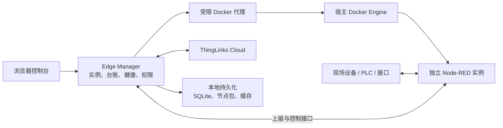
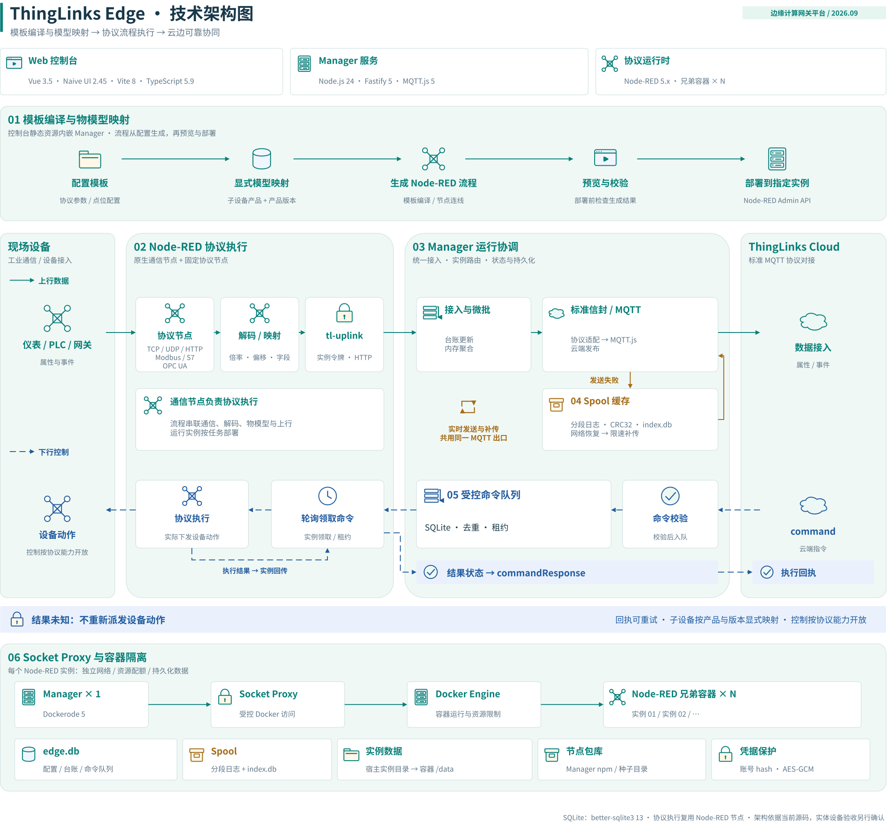

# ThingLinks Edge 架构说明

这组图用于解释产品职责、运行链路和部署边界。README 展示产品总览与折叠的部署图；技术和功能细节集中在本目录。
架构图不代表所有协议、硬件或云端链路已完成交付验收。

| 视图 | 主要用途 | 图文件 |
| --- | --- | --- |
| 产品架构 | 了解 Edge 能力及与 Cloud 的分工 | [产品架构 SVG](../images/architecture/edge-product.svg) |
| 功能架构 | 查看功能分组、已有模板和条件限制 | [功能说明](features.md) |
| 技术架构 | 查看上行、缓存、命令与回执链路 | [技术架构 SVG](../images/architecture/edge-technical.svg) |
| 部署架构 | 了解单机组件和不同现场部署方式 | [部署说明](deployment.md) |

## 运行结构

控制台由 Manager 镜像提供，不需要再部署一个前端服务。Node-RED 实例是独立容器，
编辑器通过 Manager 统一进入；采集流程、设备连接和实例数据保存在各自的数据目录中。
`tl-device`、`tl-tag`、`tl-uplink` 分别承担设备登记、点位回报和数据上行的衔接，
上行聚合及断网缓存由 Manager 侧处理。

## 技术架构

- Node-RED 执行协议通信、解码与现场流程，模板负责生成流程并建立显式物模型映射。
- Manager 管理实例、设备点位、云连接与受控命令，处理上行聚合、失败缓存和补传。
- 命令采用持久化队列与领取租约。结果未知时不自动重新执行设备动作，命令回执可按策略重试。
- Manager 通过受限 Socket Proxy 访问 Docker；Node-RED 实例使用独立网络和数据目录。

## 图的来源与维护

可编辑源文件为 [thinglinks-edge.drawio](../images/sources/thinglinks-edge.drawio)，仅保留四个当前视图，未纳入外部原文件的历史设计页面。
图基于 2026.09 版本整理；部署图补充了当前 Compose 的两项配置、默认镜像自动准备与独立 `.master.key` 保存要求。

SVG 使用原生文字与图形，不包含 foreignObject、脚本或外部图片资源，避免依赖 HTML 标签渲染。
源图正文采用显式换行；保留“扩展候选”“待完善”“有条件交付”等能力标识。
修改源文件后，用 draw.io 导出对应页面为 SVG，不嵌入图源或字体，并检查正常显示、文字换行和链接。

页面顺序：1 产品、2 功能、3 技术、4 部署。展示文件分别为 `edge-product.svg`、`edge-functions.svg`、`edge-technical.svg`、`edge-deployment.svg`。

[返回中文 README](../../README.zh-CN.md) · [English README](../../README.md)
