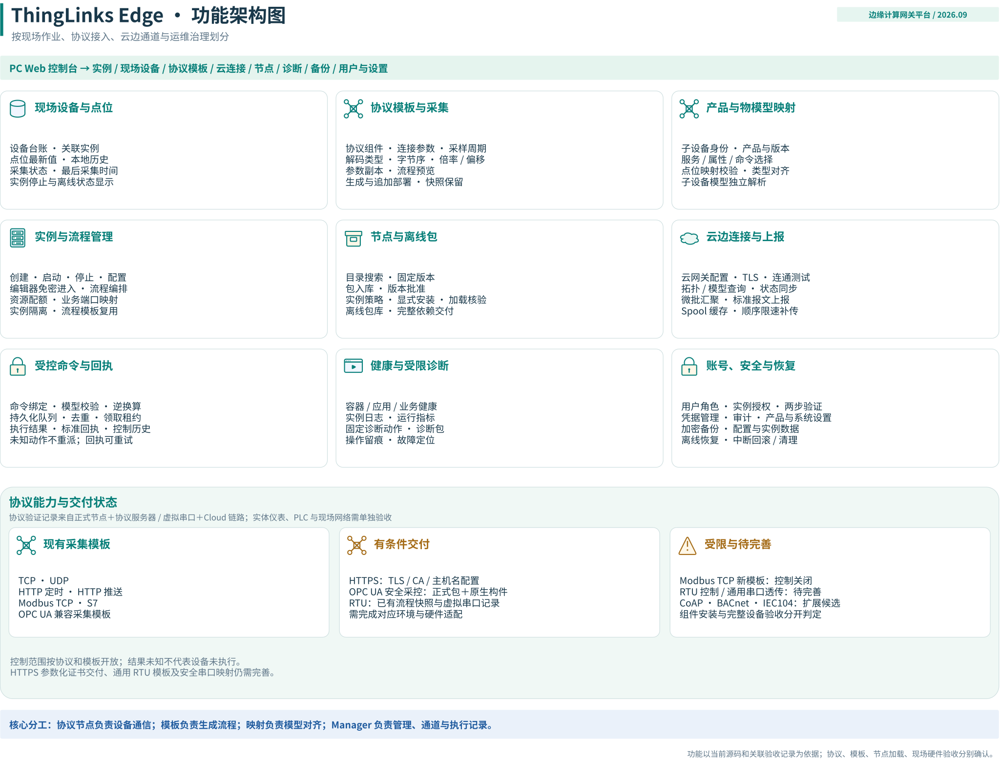

# ThingLinks Edge 功能架构

这张图按设备点位、协议模板、物模型映射、实例流程、节点包、云边连接、受控命令、诊断和账号恢复划分功能。

## 能力边界

- 已有采集模板与控制能力分开判断；不能由“能采集”推断“能写入设备”。
- HTTPS、OPC UA 和 Modbus RTU 需要匹配证书、原生组件、串口或实际硬件条件。
- CoAP、BACnet、IEC104 在图中属于扩展候选，不等于已具备完整模板或现场交付能力。
- 节点包入库、批准、成功加载和设备端到端验收是不同状态。
- 协议参数截图来自演示配置；历史截图与架构图都不能代替当前现场验收。

[架构总览](README.md) · [返回 README](../../README.zh-CN.md)
